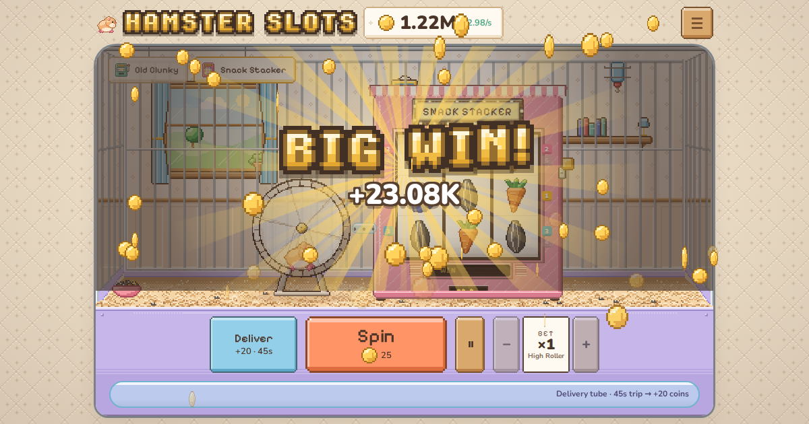

# Hamster Slots

A cute pixel-art idle slot machine, powered by a hamster on a wheel.

**Play it in your browser: https://nxt549.github.io/hamster-slots/**

Spin the reels, win coins, buy upgrades, and teach your hamster to run the wheel by itself. When you run out of coins, the hamster goes on a food delivery, so you can never get stuck. Later on, retire to the Big Cage, pass Heirloom Seeds on to the next pup and grow the Family Tree.

**All coins are pretend.** There's no real money in the game, and nothing to buy with real money.

## What's in it

- **Seven slot machines**: Old Clunky, the Snack Stacker, the Burrow Bonanza, the Pouch Palace, and for the late game the Hamster Maze (243 ways), the Acorn Vault (hold & spin) and the Big Cheese (a multiplier wheel). Paylines, bets, wilds, free spins, a jackpot wheel with four pots, and a card gamble.
- **Upgrades** for your hamster and for every machine: payouts, auto-spin, Luck, new symbols, Pays Both Ways and more.
- **Retirement and the Big Cage**: every seed you hold pays a bonus, or plant it in the Family Tree for a trait the family keeps forever.
- **Machine Stars**: max a machine's upgrades and rebuild it for a star it keeps for good.
- **The Capsule Machine**: Hamster Tokens from your Hamster Diary buy skins for the hamster, its hat, the wheel, the machine and the room, and everything you wear gives a small buff.
- It saves by itself, keeps earning a little while you're away, and has a save backup code (Menu → Save backup).

What changed in each version: [CHANGELOG.md](CHANGELOG.md).

## Running it yourself

You need [Node.js](https://nodejs.org/) (with npm).

- **Windows:** double-click `play.bat`. It installs what it needs the first time, starts the game on `http://localhost:8765/` and opens your browser.
- **Anywhere:** `npm install`, then `npm run dev`, and open the address it prints.

Other commands: `npm test` (the tests), `npm run build` (the players' version, in `dist/`), `npm run preview` (try that build), `npm run sim` (the balance simulator).

## How it's made

TypeScript and [Vite](https://vite.dev/), with no game engine and no UI framework. The game rules live in `src/logic/` and never touch the page, so the tests and the balance simulator run them without a browser. The pixel art is drawn as text in `src/view/art.ts`, and every sound is made in the browser.

- **[AGENTS.md](AGENTS.md)**: how the project is built and the rules for working on it (read this first).
- **[DESIGN.md](DESIGN.md)**: what the game is: every system, the maths behind the machines, the roadmap.
- **[PORTING_NOTES.md](PORTING_NOTES.md)**: the platform plans (web, itch.io, Steam, phones) and the logs of decisions, balance changes and playtests.
